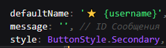
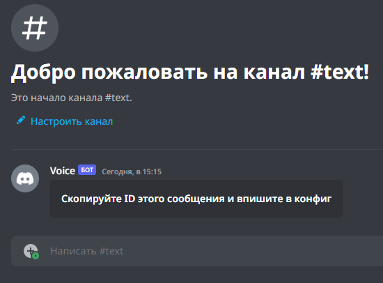

# Система приватных комнат Discord
Данный дискорд бот написан на [TypeScript](https://www.typescriptlang.org/) с использованием библиотеки [discord.js v14.7.1](https://discord.js.org/#/docs/discord.js/14.7.1/general/welcome) с очень гибкой конфигурацией
> Вы можете настроить одного бота под несколько серверов! Неужели это не круто?
# Использование

# Запуск
- Пукнт **1**: Подготовка
- - `npm i` в терминал
- - Заполнить конфиг в `src/config.ts`:
- - ID гильдии, гс канала, текстового канала и так далее... **(кроме ID сообщения!)**
- - 
- Пукнт **2**: Компиляция кода
- - `npx tsc` или `tsc build` в терминал
- - `node dist/index.js` в терминал
- - При ошибках проверьте все ли вы записали в конфиге
- - Если что-то Вы не поняли то можете создать тикет на [моем сервере](https://discord.gg/cHNKgpNNJv)
- Пукнт **3**: После успешного запуска бот отправит в канал такое сообщение
- - 
- - Впишите ID сообщения в конфиг
- Пукнт **4**: Компиляция кода
- - `npx tsc` или `tsc build` в терминал
- - `node dist/index.js` в терминал

Если Вы хотите установить кастомные эмодзи, то загрузите их на **любой общий сервер с ботом** и вставьте в конфиг либо их `id` либо полность их в формате `<:name:id>`
## В конце я хочу же Вас попросить поставить ⭐ на этот репозиторий